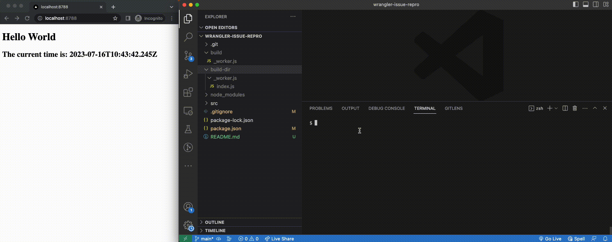

# When _worker.js is a directory and its index.js file is invalid `wrangler pages dev` crushes

## Reproduction

### _worker.js file

> **Note**: This shows how having an invalid file works with `_worker.js` (and how it should work when `_worker.js` is a directory)

- run:
```sh
$ npm i
$ npm run build
$ npm run dev
```

- open the browser at the app's port and see that it works as expected

- remove half of the `build/_worker.js` script (just to make the script invalid)

- notice that an error is logged in the terminal but wrangler still serves the old app with no issues, if you restore the file and apply changes to it those appear in the served app (so, everything is back to normal)




### _worker.js directory

- run:
```sh
$ npm i
$ npm run build-dir
$ npm run dev-dir
```

- open the browser at the app's port and see that it works as expected

- remove half of the `build/_worker.js/index.js` script (just to make the script invalid)

- notice that an error is logged in the terminal and wrangler still serves the old app, but **the wrangler process has crushed** so if you restore the file and apply changes to it those won't appear in the served app (and if you try to restart the process the port previously used is still used/unreleased by the dev sever which hasn't been killed)

